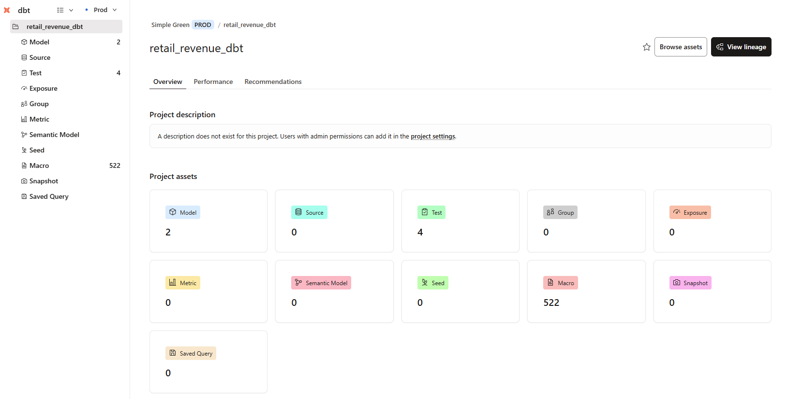
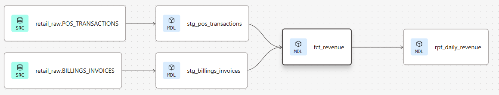

# Retail Revenue Analytics (Snowflake + dbt + Power BI)

## 📌 Overview

This project demonstrates an end-to-end analytics engineering workflow using Snowflake, dbt, and Power BI to model, validate, and report retail revenue data from multiple operational sources.

Raw transactional data is ingested into Snowflake, transformed using dbt into clean staging and fact models, and exposed through reporting tables optimized for BI consumption.



## 🏗️ Architecture

## Data Flow

CSV Sources
   ↓
Snowflake (RAW)
   ↓
dbt Staging Models
   ↓
dbt Fact Models
   ↓
Reporting Models
   ↓
Power BI

Source Systems

- POS Transactions
- Billing Invoices
- Products
- Customers

## 📁 Project Structure

## 📁 Project Structure

```
.
├── analyses/
├── docs/
│   ├── dbt_lineage.png
│   └── dbt_project_overview.png
├── macros/
├── models/
│   ├── staging/
│   │   ├── stg_pos_transactions.sql
│   │   └── stg_billings_invoices.sql
│   ├── marts/
│   │   ├── fct_revenue.sql
│   │   └── rpt_daily_revenue.sql
│   ├── sources.yml
│   ├── staging.yml
│   └── marts.yml
├── seeds/
│   ├── pos_transactions.csv
│   ├── billings_invoices.csv
│   ├── customers.csv
│   └── products.csv
├── snapshots/
├── tests/
├── README.md
└── dbt_project.yml
```

## 🗄️ Data Models
### **Staging Layer**

Purpose: **Clean, standardize, and type-cast raw data**

Example: `stg_pos_transactions.sql`

```sql
select
    pos_transaction_id,
    cast(transaction_date as date) as transaction_date,
    store_id,
    store_name,
    store_state,
    product_id,
    product_name,
    category,
    quantity,
    unit_price,
    discount_amount,
    net_sales,
    payment_type
from {{ source('retail_raw', 'POS_TRANSACTIONS') }}
```
✔ Shows dbt best practices  
✔ Shows source usage  
✔ Not too long 

---

## 🧮 Example: Fact SQL

Actions performed:


### **Fact Layer**

```markdown
### 🧮 Fact Layer

Fact models consolidate multiple staging sources into analytics-ready
tables with business logic applied.

Example: `fct_revenue.sql`

```sql
select
    transaction_date as revenue_date,
    revenue_channel,
    sum(net_sales) as revenue_amount,
    sum(quantity) as units
from (
    select
        transaction_date,
        'POS' as revenue_channel,
        net_sales,
        quantity
    from {{ ref('stg_pos_transactions') }}

    union all

    select
        invoice_date as transaction_date,
        'BILLINGS' as revenue_channel,
        net_sales,
        quantity
    from {{ ref('stg_billings_invoices') }}
)
group by 1, 2
```

Features:

- Combines POS and billing revenue
- Normalizes revenue structure
- Enables channel-level comparisons

---

### **Reporting Layer**

```markdown
### 📈 Reporting Layer

Reporting models aggregate fact data into BI-friendly tables optimized
for dashboard consumption.

Example: `rpt_daily_revenue.sql`

```sql
select
    revenue_date,
    revenue_channel,
    sum(revenue_amount) as revenue_amount,
    sum(units) as units
from {{ ref('fct_revenue') }}
group by 1, 2
order by 1, 2
```

Output:

- Daily revenue by channel
- Total revenue and units
- Optimized for Power BI consumption

## ✅ Data Quality & Testing

dbt tests implemented:

- not_null
- unique
- Referential integrity checks
- Source freshness validation

Tests are defined in:
- staging.yml
- marts.yml

All models successfully pass dbt test.

## 📈 dbt Lineage

The following lineage graph shows the full transformation path from raw sources to reporting models:



Flow:

RAW → STAGING → FACT → REPORT

## 📚 dbt Documentation

dbt documentation was generated and deployed using:

**dbt docs generate**

The project includes:

- Model-level documentation
- Column descriptions
- Test visibility
- Full lineage exploration

## 📊 Power BI Integration

The final reporting table:

**RETAIL_DB.STAGING.RPT_DAILY_REVENUE** is designed to be consumed directly by Power BI.

**Power BI Design Considerations**

- Import mode recommended for performance
- Date hierarchy supported

Measures built for:
   - Total Revenue
   - Total Units
   - Revenue by Channel
   - Daily Trends
- KPI visuals enabled for executive dashboards

Power BI connects directly to Snowflake using native connectors.

## 🚀 How to Run This Project

```text
dbt run
dbt test
dbt docs generate
```

To build only specific layers:

```text
dbt run --select staging
dbt run --select fct_revenue
dbt run --select rpt_daily_revenue
```

## 🛠️ Tools Used

**Snowflake** – Cloud data warehouse

**dbt Cloud** – Transformations, testing, documentation

**Power BI** – Analytics & visualization

**GitHub** – Version control

## 🎯 Key Takeaways

- Demonstrates modern analytics engineering best practices
- End-to-end lineage from raw data to BI
- Production-ready dbt project with testing and documentation
- Designed for real-world reporting and stakeholder consumption


